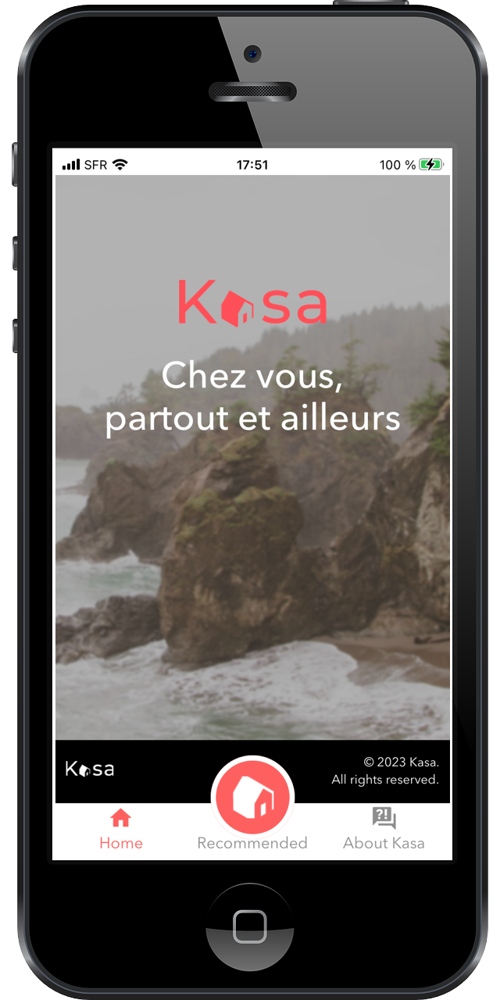
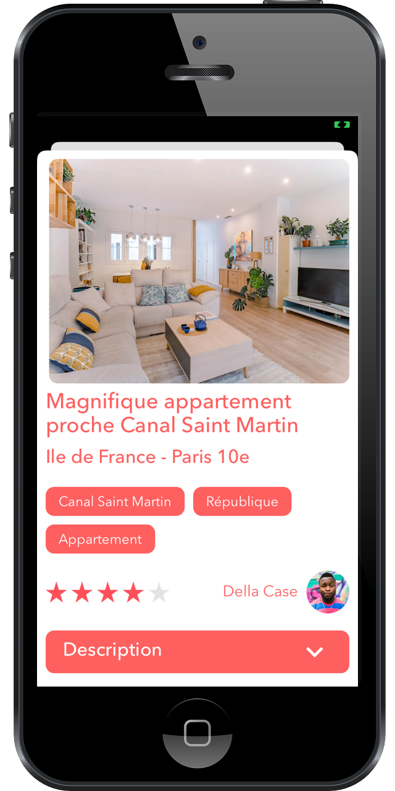
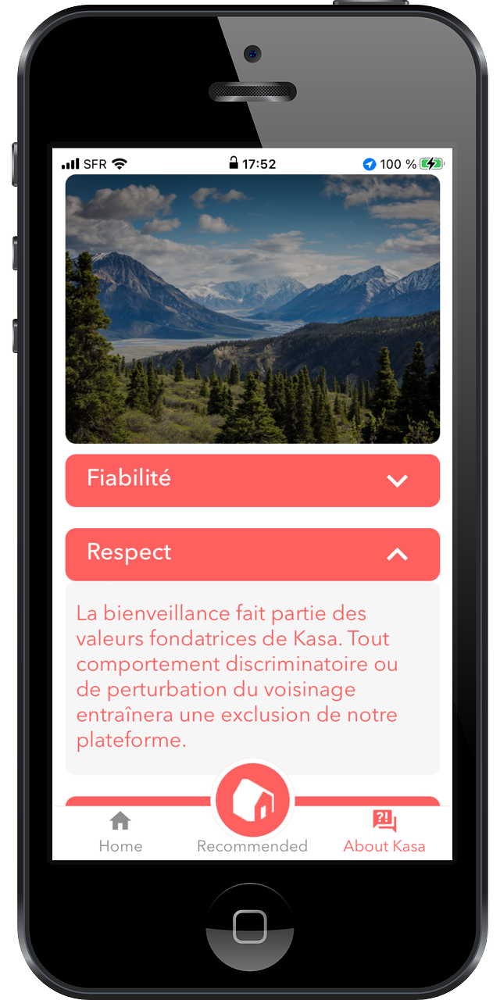

## Project

An extracurricular project to build a mobile app using React Native.

It uses design and assets of an earlier [Openclassrooms Project #011 - Développez une application Web avec React et React Router](https://github.com/kidereo/oc-p011) to build a companion mobile app for the Kasa website.

## Path

Développeur d'application - JavaScript React

## About this project

This project was bootstrapped with [Expo](https://expo.dev) and [create-expo-app](https://docs.expo.dev/get-started/create-a-new-app/).

## Visuals

## Installation

1. Clone the repository: `https://github.com/kidereo/kasa-app.git`.
2. Use Terminal to navigate to your local repo folder. Once there, install dependencies: `npm install`.
3. Launch the project with `npm run start`.
4. Use [Expo Go client](https://expo.dev/client) on your mobile to test drove the Kasa app.
