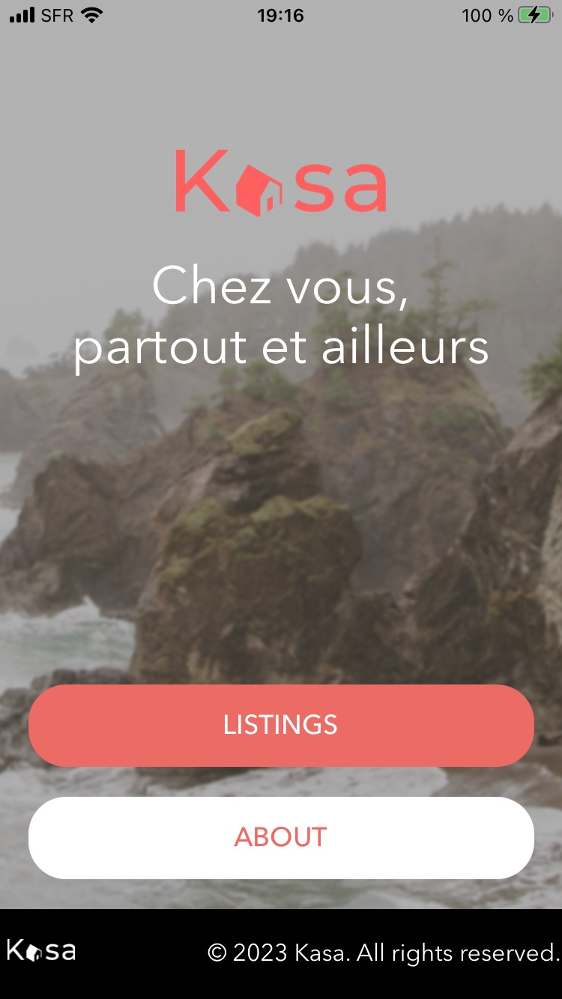

## Project

An extracurricular project to build a mobile app using React Native.

It uses design and assets of an earlier [Openclassrooms Project #011 - Développez une application Web avec React et React Router](https://github.com/kidereo/oc-p011) to build a companion mobile app for the Kasa website.

## Path

Développeur d'application - JavaScript React

## About this project

This project was bootstrapped with [Expo](https://expo.dev) and [create-expo-app](https://docs.expo.dev/get-started/create-a-new-app/).

## Visuals

